# Diagrama clases

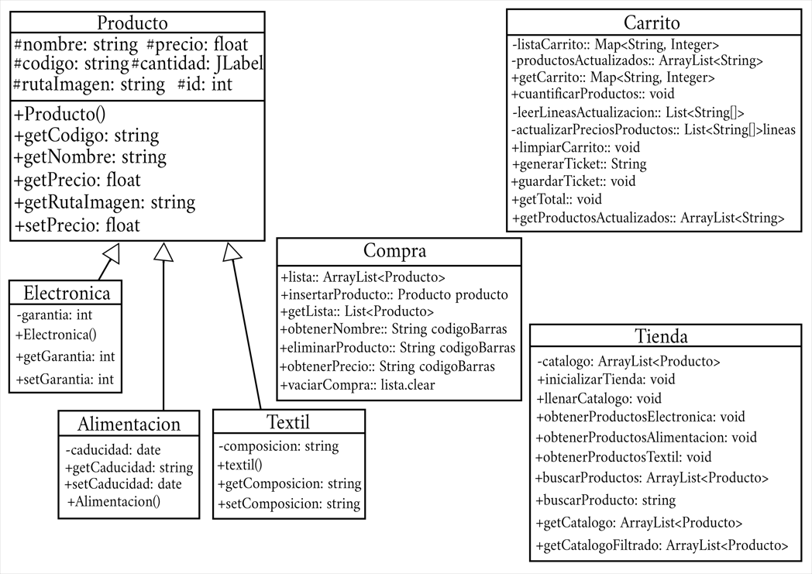

# Estructura del src

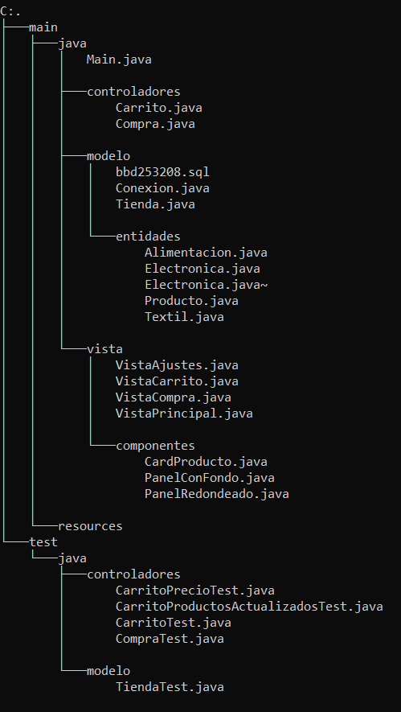

# Capturas test

## Test para la comprobación del calculo del precio del carrito

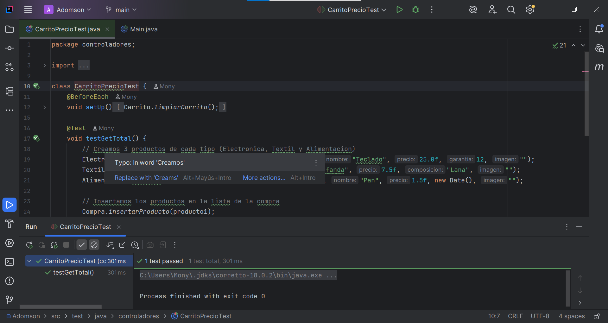

## Test agregar producto de electronica

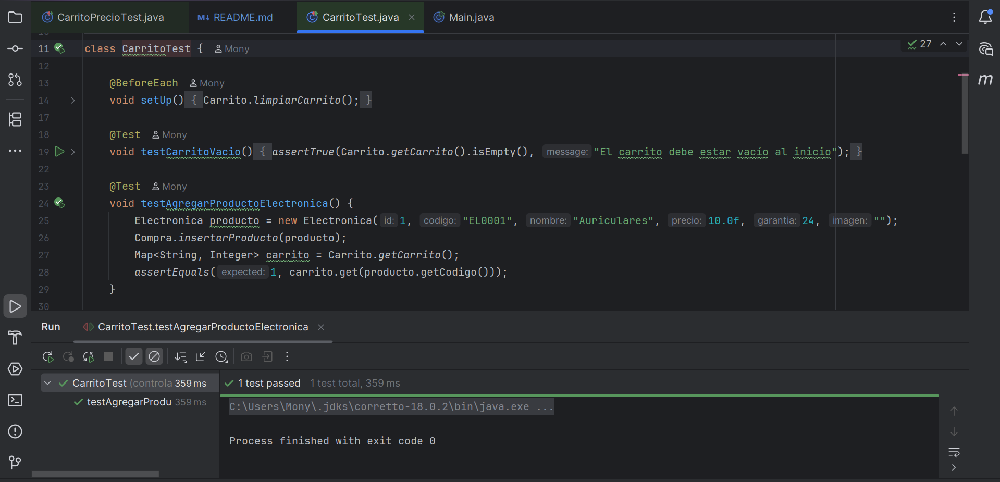

## Test agregar producto de textil

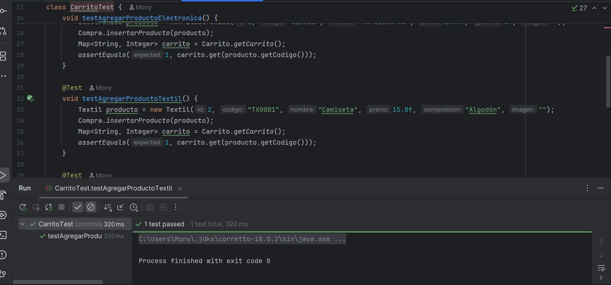

## Test agregar producto de alimentacion

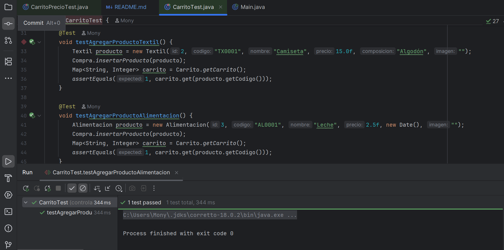

## Test para limpiar el carrito

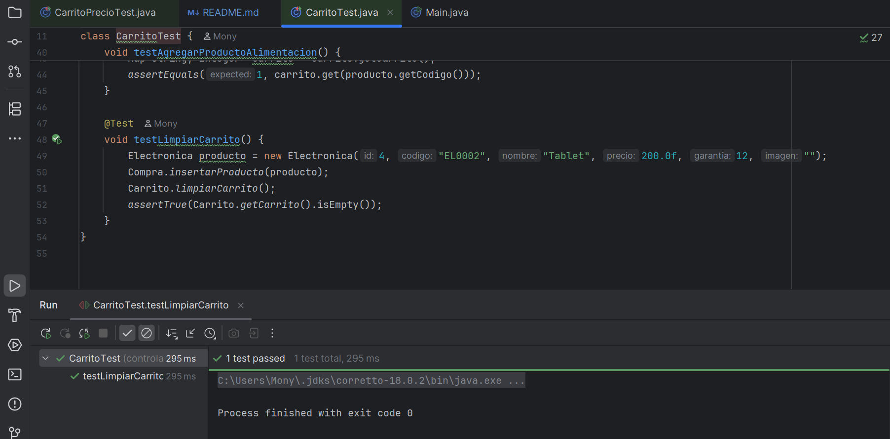

## Test eliminar producto de electronica

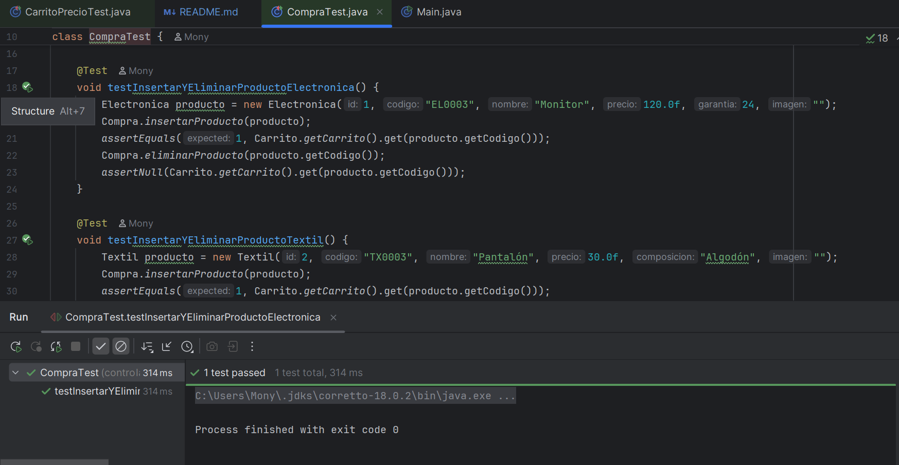

## Test eliminar producto de textil 

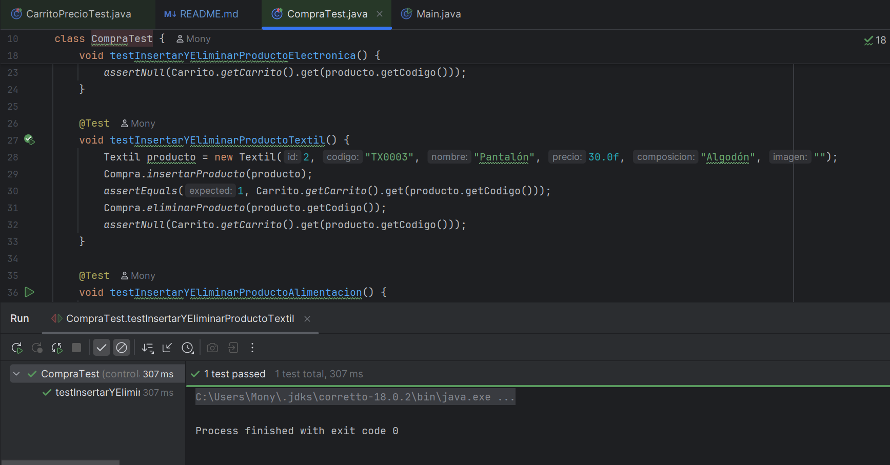

## Test eliminar producto de alimentacion

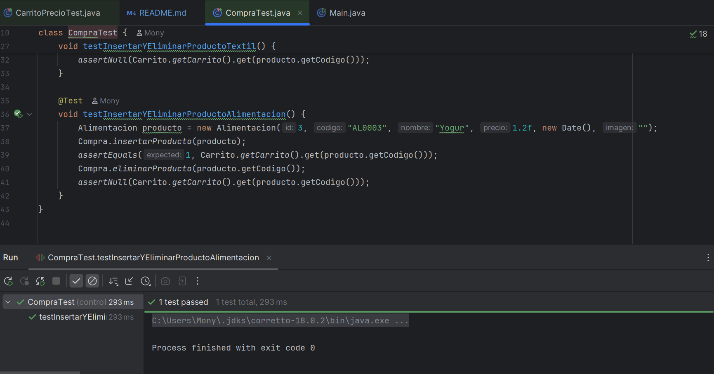

## Test buscar producto filtro

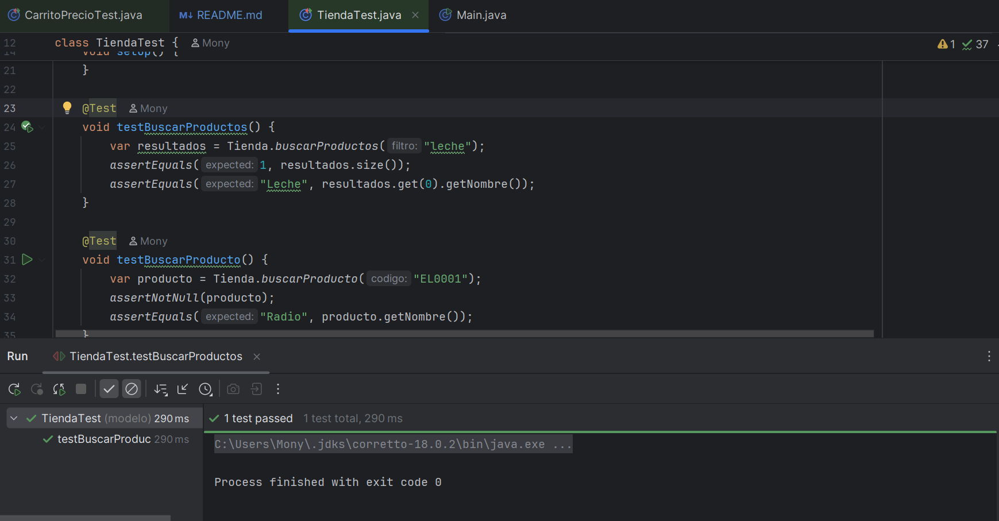

## Test buscar producto codigo

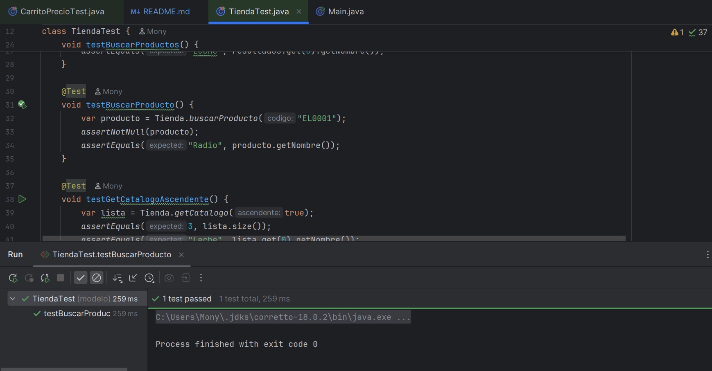

## Test ordenar catalogo ascendente

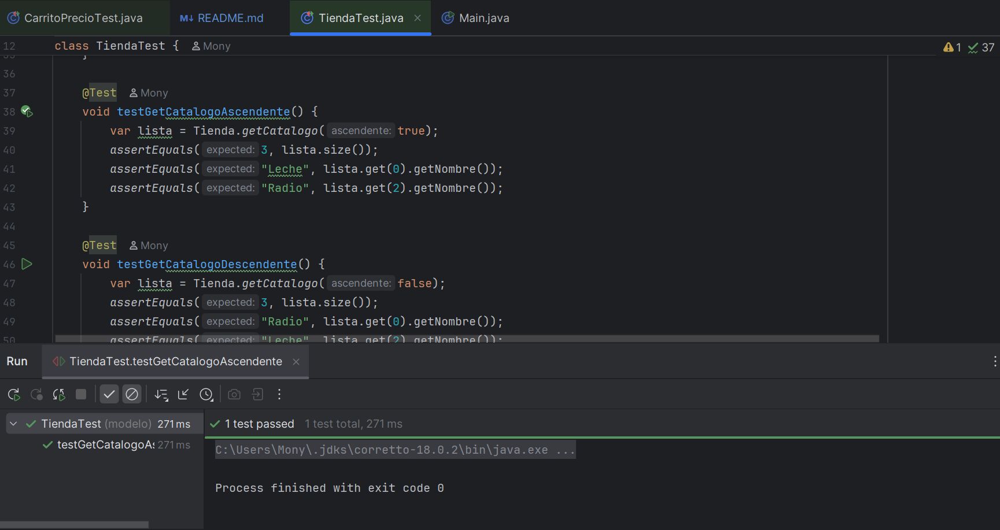

## Test ordenar catalogo descendente

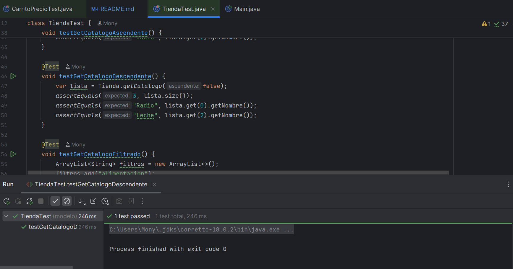

## Test de catalogo filtrado

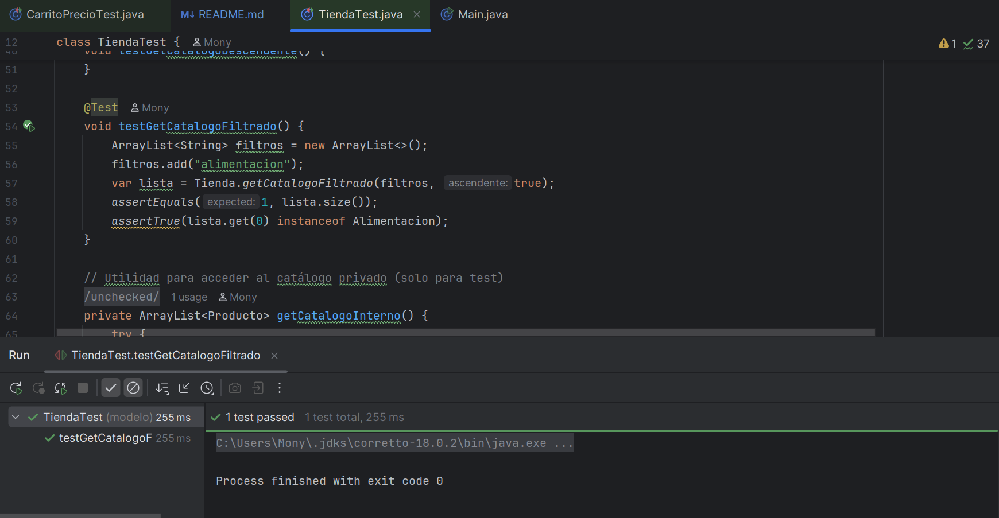